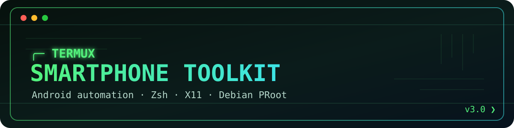
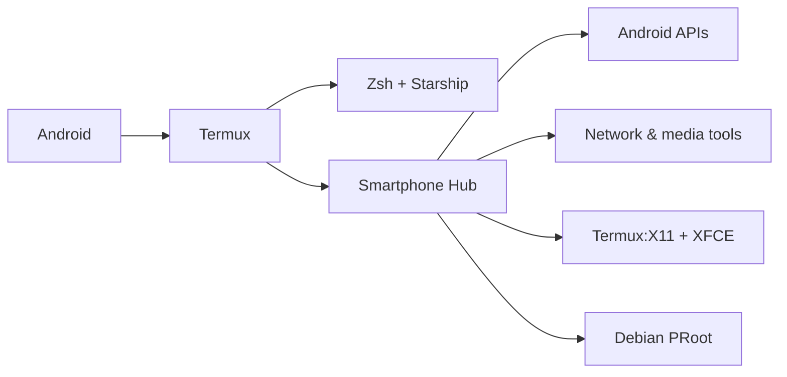

<p align="center">
  
</p>

<p align="center">
  <a href="#quick-start"></a>
  
  
  
</p>

<p align="center">
  A mobile-first shell and automation hub that turns Termux into a practical Android toolbox.
</p>

## What it does

Termux Smartphone Toolkit installs a customized Zsh/Starship shell and displays an interactive control center whenever a new Termux session starts.

The toolkit combines everyday Android automations, network utilities, media tools, Termux:X11 and an optional Debian PRoot environment behind one command:

```bash
phone
```

```text
╭────────────────────────────────────────╮
│  TERMUX SMARTPHONE HUB v3              │
├────────────────────────────────────────┤
│ Battery, network, storage and device   │
╰────────────────────────────────────────╯

1) Complete phone status
2) Clipboard and text-to-speech
3) Share a folder over trusted Wi-Fi
4) Check Internet and network
5) Discover devices on an authorized LAN
6) Compress a video
7) Create a QR code from the clipboard
8) Configurable battery notification
9) Back up the Termux configuration
G) Start XFCE through Termux:X11
D) Enter Debian PRoot
```

## Highlights

- Two-line **Starship** prompt optimized for a phone display
- Zsh autosuggestions, syntax highlighting and searchable history
- Smart navigation with **zoxide** and **fzf**
- Modern aliases powered by **eza** and **bat**
- Battery, temperature, storage, network and Android information
- User-selectable battery threshold from 1% to 100%
- Android notification scheduled every 15 minutes while charging
- Clipboard, text-to-speech and QR-code integrations
- Local HTTP file sharing for trusted networks
- Network diagnostics and authorized LAN discovery
- Video compression with FFmpeg
- One-command XFCE startup through Termux:X11
- Optional Debian environment through PRoot-Distro
- Automatic backups of existing Zsh and Starship configuration
- Python QR fallback when `qrencode` is unavailable

## Architecture



## Quick start

Run these commands in the **main Termux environment**, not inside Debian:

```bash
pkg install git
git clone https://github.com/OS3RVNO/termux-smartphone-toolkit.git
cd termux-smartphone-toolkit
chmod +x install.sh
./install.sh
```

Start the new shell after installation:

```bash
unset TERMUX_HUB_SHOWN
exec zsh
```

The installer updates the package index, installs every available dependency and creates timestamped backups before replacing an existing `.zshrc` or `starship.toml`.

## Main commands

| Command | Purpose |
| --- | --- |
| `phone` | Open the interactive hub |
| `phone-status` | Show complete device information |
| `share` | Share a folder through a temporary HTTP server |
| `netcheck` | Test local and Internet connectivity |
| `lanscan` | Discover devices on an authorized local network |
| `compress-video FILE` | Create a smaller H.264 copy of a video |
| `makeqr` | Create a QR code from the clipboard |
| `battery-alert` | Configure or disable the charging threshold |
| `termux-backup` | Back up the toolkit configuration to Downloads |
| `gui` | Start the existing XFCE desktop through Termux:X11 |
| `debian` | Enter the Debian PRoot container |

## Battery automation

Run:

```bash
battery-alert
```

Choose any threshold between 1 and 100. Android's Job Scheduler checks the battery approximately every 15 minutes while the phone is charging and sends a single notification when the selected threshold is reached.

The notification is reset after unplugging the phone or after the charge drops below the configured hysteresis level.

## Graphical interface

If Termux:X11 and XFCE are already installed, start the desktop with:

```bash
gui
```

The launcher detects existing X11 and XFCE processes, avoids unnecessary duplicate sessions and opens the appropriate Android activity. Diagnostic output is stored in:

```text
~/.config/termux-toolkit/termux-x11.log
```

## QR compatibility

Some Google Play Termux repositories do not provide the native `qrencode` package. When that happens, the installer automatically installs the pure-Python `qrcode` implementation and the hub transparently uses its `qr` command.

## Security notes

- `share` starts an unauthenticated HTTP server. Use it only on a trusted network and stop it with `Ctrl-C` when finished.
- Run `lanscan` only on networks you own or are explicitly authorized to test.
- Debian's `root` user is simulated by PRoot and does **not** grant Android root access.
- SSH keys and other secrets are intentionally excluded from toolkit backups.
- Review scripts before execution, especially when using forks or modified copies.

See [SECURITY.md](SECURITY.md) for reporting security issues.

## Tested environment

- Termux Google Play `2026.06.21`
- Android 16
- `aarch64`
- XFCE through Termux:X11
- Debian through PRoot-Distro

Other Termux distributions may expose different repositories or require a matching Termux:API companion application.

## Project status

This is a personal learning project focused on Linux/Android integration, shell scripting and practical automation. Development was AI-assisted, with functionality tested and adapted on a real Android device.

Contributions and compatibility reports are welcome.
